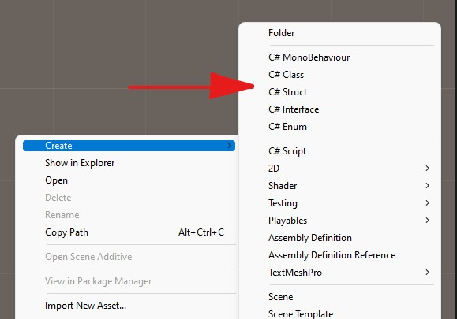

# ScriptsMenu
Данный проект поможет вам быстро создавать файлы с кодом нужного вам шаблона.

Имеются быстрые меню для следующих типов:
- `классы`
- `структуры`
- `интерфесы`
- `перечисления`
- `скрипты`

